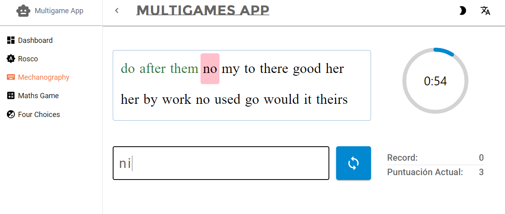
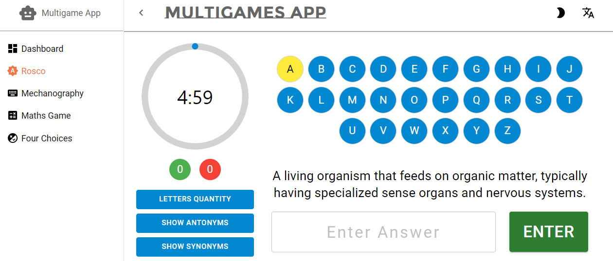
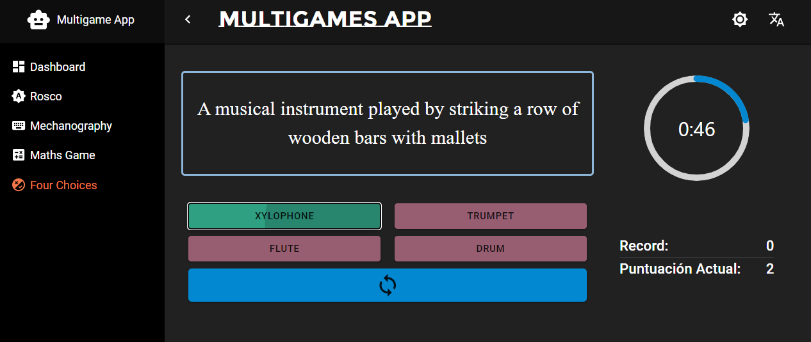

# Multigames App

Welcome to the Multigames App! This application offers a collection of four engaging games to challenge and entertain users. Built with React, Vite, and TypeScript, this app provides a seamless and enjoyable gaming experience.

## Games

### 1. MathGame

**Objective:** Calculate the highest number of random mathematical expressions within one minute.
<p align="center">
  
</p>

### 2. MechanographyGame

**Objective:** Type as many words as possible within one minute.

<p align="center">
  
</p>

### 3. Rosco

**Objective:** Guess the correct word based on a given definition. There are as many definitions as letters in the alphabet.

<p align="center">
  
</p>

### 4. FourChoices

**Objective:** Choose the correct word from four options, matching the given definition.

<p align="center">
  
</p>

## Getting Started

Follow these steps to run the Multigames App locally:

1. **Clone the repository:**

   ```bash
   git clone https://github.com/joaquincleva/multigamesApp.git

2. **Navigate to the project directory:**

   ```bash
   cd multigamesApp

3. **Install dependencies:**

   ```bash
   npm install

4. **run the App:**

   ```bash
   npm run dev

The app will be accessible at [http://localhost:5173](http://localhost:5173).

### Technologies Used

- React
- Vite
- TypeScript
- Mui/Material
- Ant-Design
- i18next

## Acknowledgments

Feel free to explore, enjoy the games, and have fun! If you encounter any issues or have suggestions, please open an issue.
