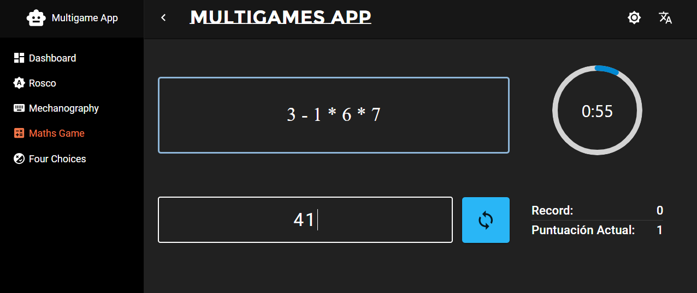

# Game Suite App

Welcome to the Game Suite App! This application offers a collection of four engaging games to challenge and entertain users. Built with React, Vite, and TypeScript, this app provides a seamless and enjoyable gaming experience.

## Games

### 1. MathGame

**Objective:** Calculate the highest number of random mathematical expressions within one minute.



### 2. MechanographyGame

**Objective:** Type as many words as possible within one minute.


### 3. Rosco

**Objective:** Guess the correct word based on a given definition. There are as many definitions as letters in the alphabet.


### 4. FourChoices

**Objective:** Choose the correct word from four options, matching the given definition.


## Getting Started

Follow these steps to run the Game Suite App locally:

1. **Clone the repository:**

   ```bash
   git clone https://github.com/joaquincleva/multigamesApp.git

2. **Navigate to the project directory:**

   ```bash
   cd multigamesApp

3. **Install dependencies:**

   ```bash
   npm install

4. **run the App:**

   ```bash
   npm run dev

The app will be accessible at [http://localhost:5173](http://localhost:5173).

### Technologies Used

- React
- Vite
- TypeScript

## Acknowledgments

Special thanks to the developers and contributors who made this Game Suite App possible.

Feel free to explore, enjoy the games, and have fun! If you encounter any issues or have suggestions, please open an issue.
